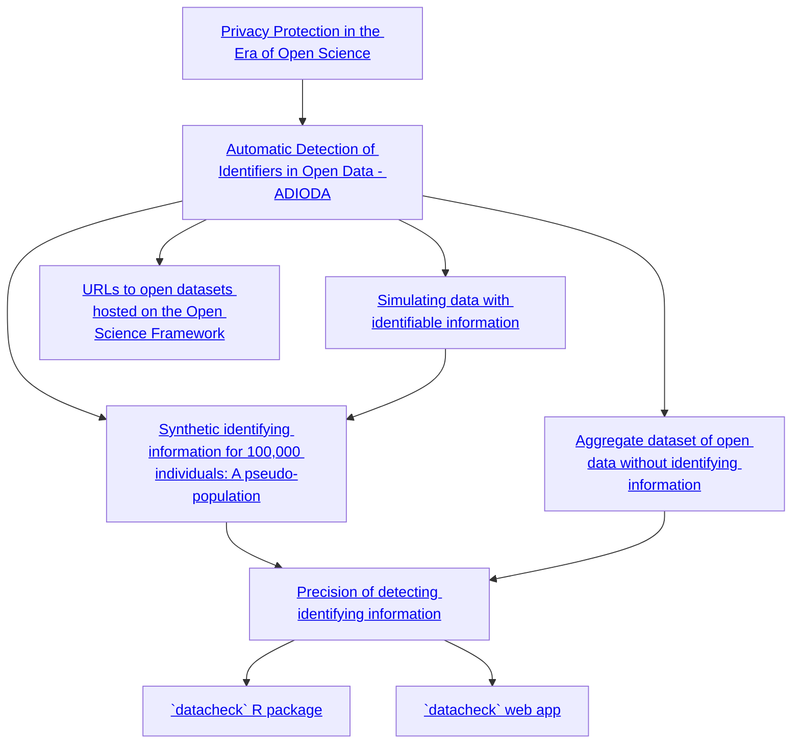

# `datacheck` web app

This is a web app to accompany the R package. This is the final outcome of the NWO Open Science Fund project done together with the Meta-Research Center from Tilburg University.

## Project overview 



## Screenshot


## Development

```bash
npm install
npm run dev
```

